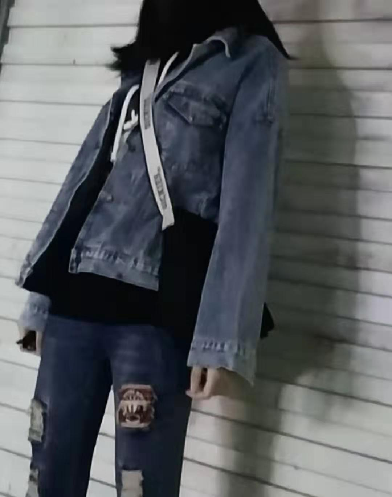
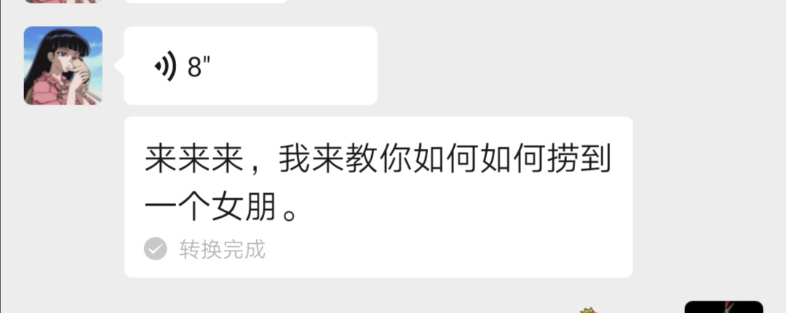
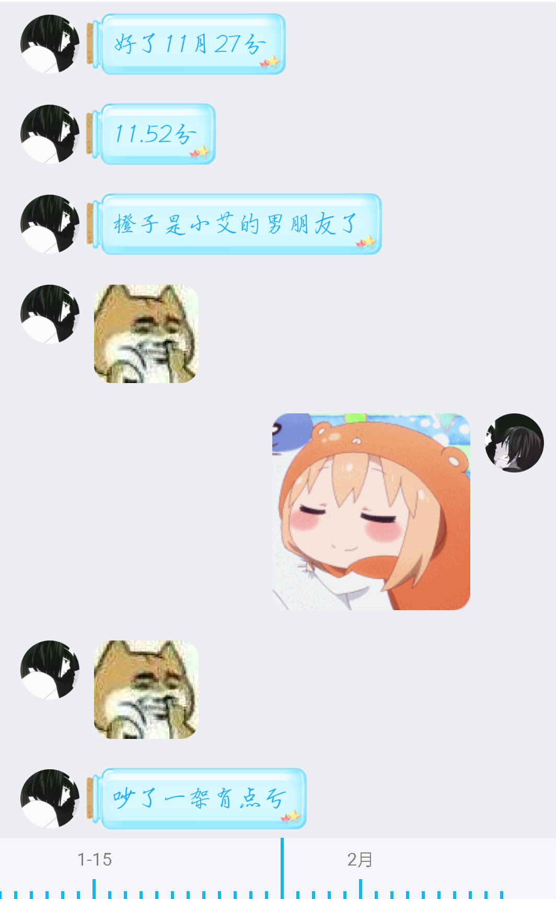

<!--
 * @Author: Yaodecheng
 * @Date: 2020-02-12 11:22:38
 * @LastEditors  : Yaodecheng
 -->
咦，这里居然有位超好看的玩长板的小姐姐飘过，好想认识你呀！但是我又不好意思呢，没想到小胖子居然认识你，那就过去打个招呼吧！伸手，假装很自然地来个板友见面礼（其实超紧张），然后再非常愉快地加微信......我们就这么认识了。

亲爱的小艾、房小姐、佳莹，不管你叫什么，我都同样喜欢你。自打第一次见到你，甚至都没来得及看清你的脸，但是直觉告诉我你就是我生命中的那个她。

2020年1月5号的晚上，我们第一次用微信聊天，好奇妙的感觉，跟你聊天就很愉快很开心，那天晚上我2020年第一次失眠了，尽管第二天是周一，需要早起上班，可哪有如何，遇见你的缘分就足以让我高兴到天亮了。那天晚上，我想了好多，想到我长这么大都没有勇气去追求过任何一个女孩子，我多希望能遇到一个啊。今天让我遇见了，可是我又害怕，不知道是否能成功，不知道路能走多长。连想到我目前的工作，也是害怕失败，害怕看不到头，真是像极了爱情。我想我不可以再这样下去了，趁青春还在，何不试试看，大胆一点跟你谈一场甜甜的恋爱，不然我会后悔死的。于是，第二天清晨我在QQ签名上写下了”这一夜，我都有了目标”。

从那天起，每天最快乐的事情就是下班后找你玩，找你聊天。不过后来我发现我挺不会聊天的，老是惹你生气，对不起啦，多多包涵我这只橙子怪兽啦，阿里嘎多，我最最最亲爱的小艾！就这样我陪你去吃好吃的，去玩滑板，去打游戏，走过无人的小道，聊着跳跃性超大的话题。

22天过去了，27号晚上，我们吵了的一次架，那天你说了很多，最后说我们到此为止吧，就把我删了，那会我哭了，眼泪流下来才发现我不知道什么时候开始已经这么喜欢你了，才不到一个月。就在我已经放下手机，打算就此别过吧。没想到你给我回短信了，就像刚刚认识那会你给说，教我如何把你捞回来。

在小艾同学的热心教导下，成功捞了回来，并且当晚小艾同学还宣布了橙子可以当小艾的男朋友了。哈哈，真开心！

小艾说，吵了一架有点亏，这怎么可以呢，怎么能让小艾吃亏呢，往后余生，我只要你，往后余生，风雪是你，平淡是你，清贫是你，荣华是你，心底温柔是你，目光所至，也是你。我希望后面的日子能够一直陪着小艾，我一定会好好爱小艾的，今天我要正式向小艾表白，小艾，你做我女朋友好吗？